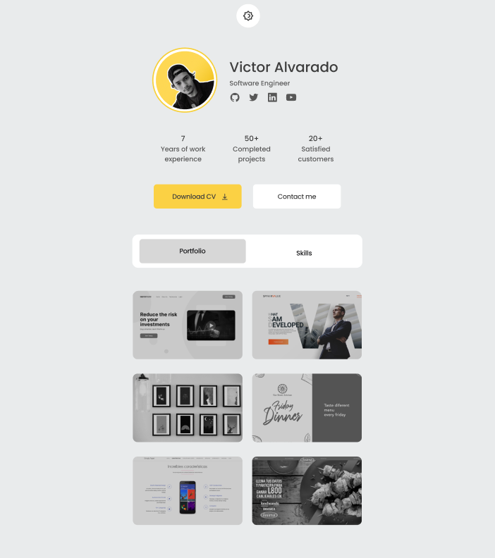

# portfolio-django
My portfolio with django and django rest framework
## Setup
1. Clone this repository
2. Verify this commands
```commandline
python --version
pip --version
virtualenv --version
```
3. Create a instance of virtualenv
```commandline
virtualenv venv
```
4. Activate virtualenv
5. Install all dependency 
```commandline
pip install -r requirements.txt
```
6. Create file .env.local and .env.production with this schema
```
DB_USERNAME=YOUR_USERNAME_DB
DB_PASSWORD=YOUR_PASSWORD_DB
DB_HOST=YOUR_HOST_DB
DB_PORT=YOUR_PORT_DB
SECRET_TEXT=YOUR_SECRET_APP
```
7. Load data initial 
```commandline
python manage.py loaddata *.json
```
8. Run aplication
```commandline
python manage.py runserver
```
8. Working scss
```commandline
npm i -g sass
```
9. 
8. Example Figma



